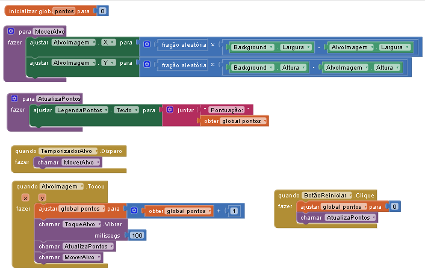

# Desenvolvimento Mobile Android | Android Mobile Development

[Português](#português) | [English](#english)

---

<h2 id="português">Versão em Português</h2>

**Hardware de Validação:** Redmi Note 14  
**Ambiente:** MIT App Inventor 2

### Projetos e Implementações

#### 01. Hello World
Implementação inicial focada no ciclo de vida de aplicações orientadas a eventos e manipulação de strings.

| Interface | Lógica (Blocos) | Hardware |
| :---: | :---: | :---: |
|  |  |  |

#### 02. Acerte o Alvo (Mini-Game)
Sistema dinâmico com animação, temporizadores e manipulação de variáveis globais.

* **Lógica:** Cálculo vetorial para posicionamento randômico em `Canvas`.
* **Hardware:** Integração de Feedback Háptico (Vibração: 100ms).
* **Clock:** Game Loop sincronizado em 500ms.

| Interface | Lógica de Programação | Hardware (Redmi) |
| :---: | :---: | :---: |
|  |  |  |

---

<h2 id="english">English Version</h2>

**Validation Hardware:** Redmi Note 14  
**Environment:** MIT App Inventor 2

### Projects & Implementations

#### 01. Hello World
Initial implementation focused on event-driven application lifecycle and string manipulation.

#### 02. Hit the Target (Mini-Game)
Dynamic system featuring animation, timers, and global variable management.

* **Logic:** Vector calculation for random positioning on `Canvas`.
* **Hardware:** Haptic Feedback integration (Vibration: 100ms).
* **Clock:** Syncronized Game Loop at 500ms.

---
**Status:** Concluído / Completed.
