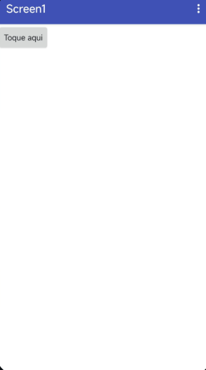
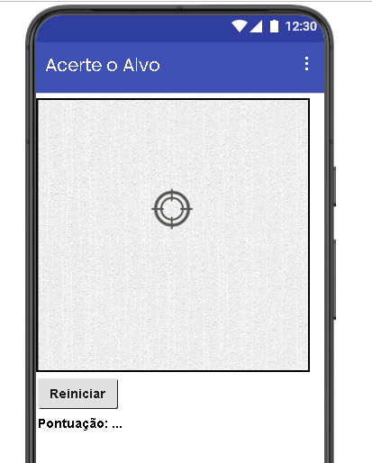
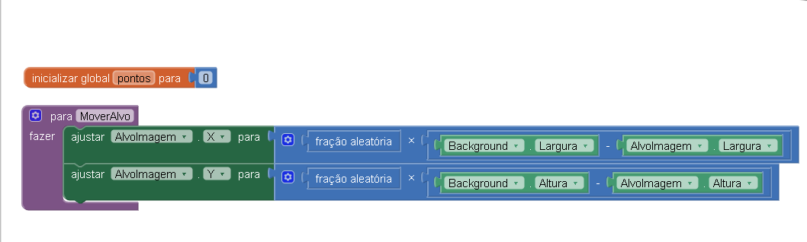
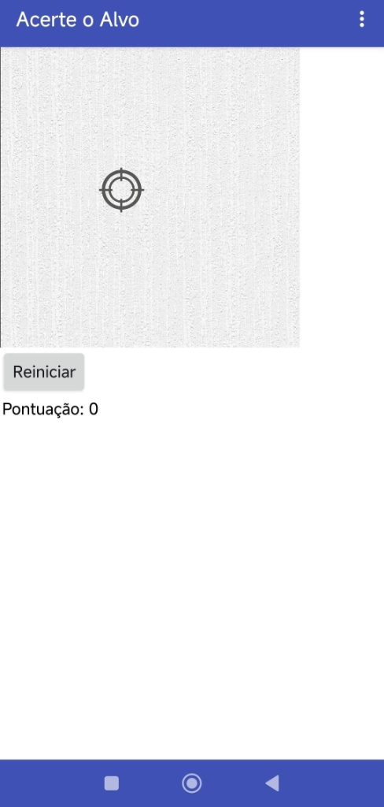

# Desenvolvimento Mobile - Android (MIT App Inventor)

Repositório dedicado ao estudo de desenvolvimento de software para dispositivos móveis, focando em lógica de programação, interface de usuário (UI) e integração com hardware real.

> **Hardware de Validação:** Redmi Note 14
> 
> **Ambiente:** MIT App Inventor 2

---

## Projetos

### 01. Hello World
Primeira implementação focada em entender o ciclo de vida de uma aplicação orientada a eventos.

#### Demonstração
| Interface Inicial | Lógica (Blocos) | Resultado Final (Hardware) |
| :---: | :---: | :---: |
|  |  |  |

---

### 02. Acerte o Alvo (Mini-Game)
Desenvolvimento de um sistema dinâmico utilizando conceitos de animação, temporizadores e manipulação de variáveis globais.

#### Especificações Técnicas
- **Lógica de Posicionamento:** Cálculo vetorial para manter o `ImageSprite` dentro dos limites do `Canvas` (X e Y aleatórios).
- **Gerenciamento de Estado:** Implementação de variável global para controle de score e sistema de reset.
- **Feedback Háptico:** Integração com o hardware para acionamento de vibração (100ms) em eventos de colisão.
- **Game Loop:** Utilização de componente `Clock` para controle de taxa de atualização (500ms).

#### Demonstração
| Interface do Jogo | Lógica de Programação | Gameplay no Redmi |
| :---: | :---: | :---: |
|  |  |  |

---

## Histórico de Aprendizado Técnica

### Fundamentos Mobile e Eventos
- Configuração de ambiente de desenvolvimento e deploy em hardware real via AI2 Companion.
- Implementação de manipulação de strings e gatilhos de User Interface (UI).

### Lógica de Games e Hardware
- Desenvolvimento de algoritmos para manipulação de coordenadas em planos cartesianos.
- Gerenciamento de variáveis globais para persistência de dados em tempo de execução.
- Integração de componentes não-visuais para feedback físico (Haptic Feedback).
