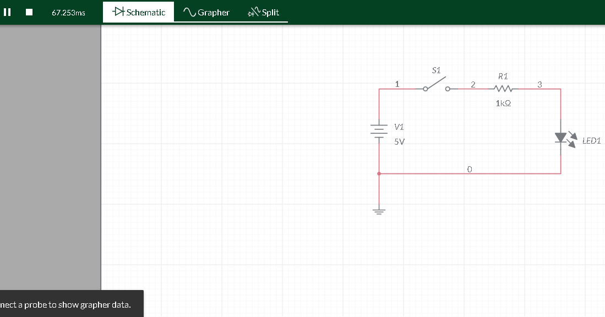
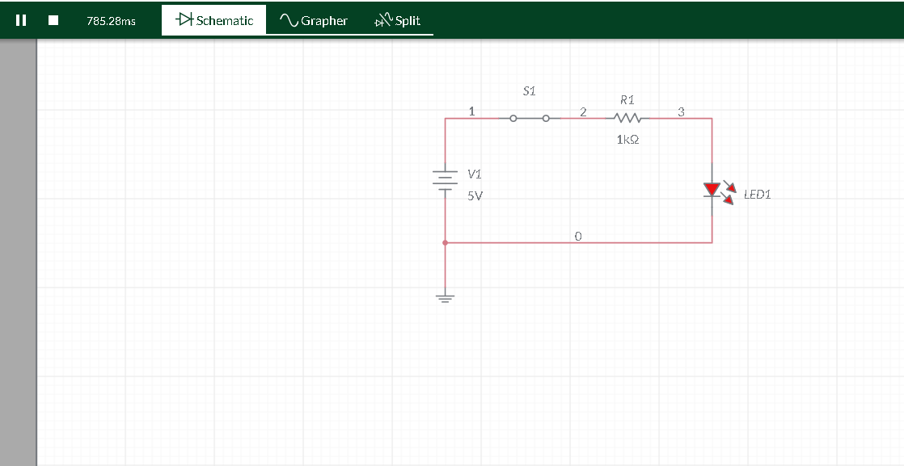
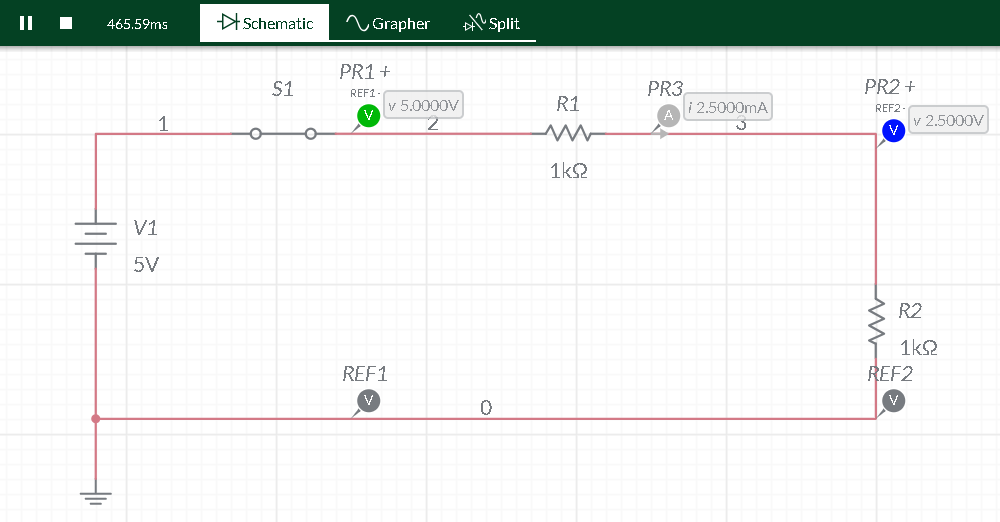
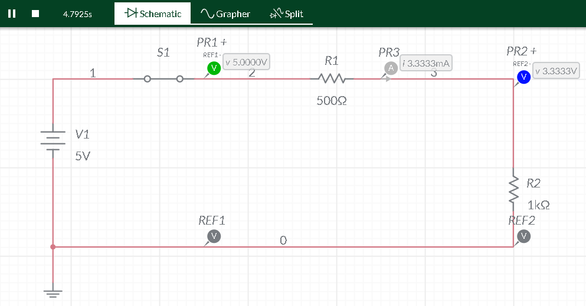
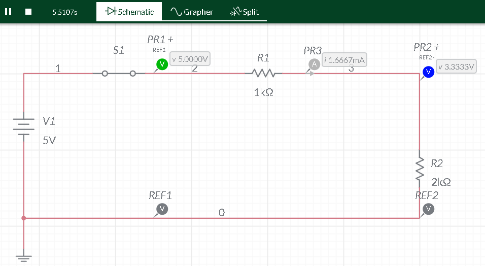
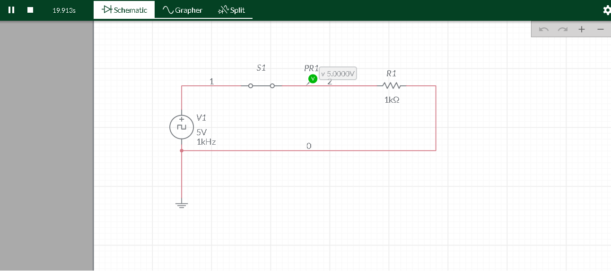
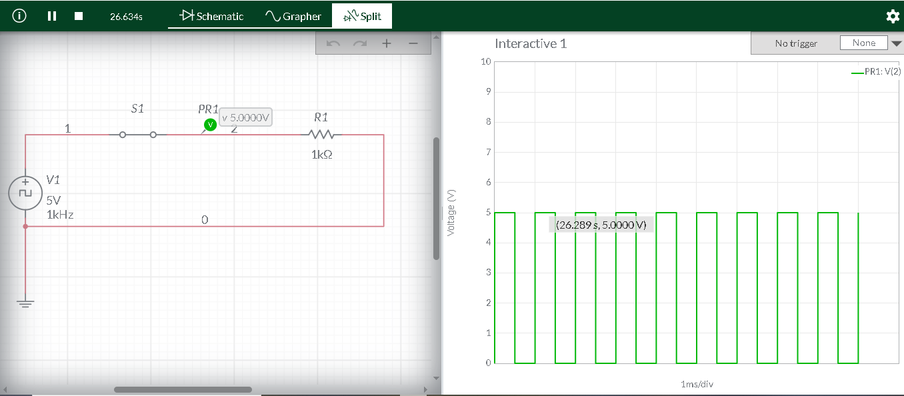

# Sistemas Eletrônicos - Práticas de Simulação | Electronic Systems - Simulation Labs

[Português](#português) | [English](#english)

---

<h2 id="português">Versão em Português</h2>

Registro de atividades práticas de eletrônica utilizando o simulador **Multisim Live**, focando em análise de circuitos DC e fundamentos de eletrônica digital.

### Prática 01: Acionamento de LED (Chave SPST)
Validação de fluxo de corrente contínua e funcionamento de componentes básicos.
* **Componentes:** Fonte 5V, Chave SPST, Resistor 1kΩ, LED Vermelho.
* **Links:** [Projeto Multisim 01](https://www.multisim.com/content/RAH4vCgwjdgd74fX57FYQj/exercicio-01-acionamento-led/)

| Circuito Aberto (OFF) | Circuito Fechado (ON) |
| :---: | :---: |
|  |  |

### Prática 02: Divisor de Tensão e Lei de Ohm
Análise de circuito em série para observação de queda de tensão e medição de corrente (Probes).
* **Configuração:** R1 (1kΩ) e R2 (Variável: 500Ω a 2kΩ).
* **Links:** [Projeto Multisim 02](https://www.multisim.com/content/99KeK9YzxqVsrFAEBNecEH/pratica-02-divisor-de-tensao-e-medicoes-em-serie/)

| Base (1kΩ) | 500Ω | 2kΩ |
| :---: | :---: | :---: |
|  |  |  |

### Prática 03: Sinal de Clock e Frequência
Introdução à eletrônica digital via análise de onda quadrada (Clock).
* **Conceito:** A relação entre Período ($T$) e Frequência ($f$):
$$f = \frac{1}{T} \implies 1kHz = \frac{1}{1ms}$$
* **Links:** [Projeto Multisim 03](https://www.multisim.com/content/QzyhmcM9BZfZv3ZYjWCuG7/pratica-03-analise-de-sinal-de-clock-e-ondas-quadradas/)

| Esquemático | Análise de Onda (Grapher) |
| :---: | :---: |
|  |  |

---

<h2 id="english">English Version</h2>

Practical electronics activities recorded via **Multisim Live**, focused on DC circuit analysis and digital electronics fundamentals.

### Lab 01: LED Activation (SPST Switch)
DC current flow validation and basic component operation.

### Lab 02: Voltage Divider & Ohm's Law
Series circuit analysis for voltage drop observation and current measurement.

### Lab 03: Clock Signal & Frequency
Digital electronics introduction via square wave analysis.
* **Concept:** Relationship between Period ($T$) and Frequency ($f$):
$$f = \frac{1}{T} \implies 1kHz = \frac{1}{1ms}$$

---
**Status:** Concluído / Completed.
