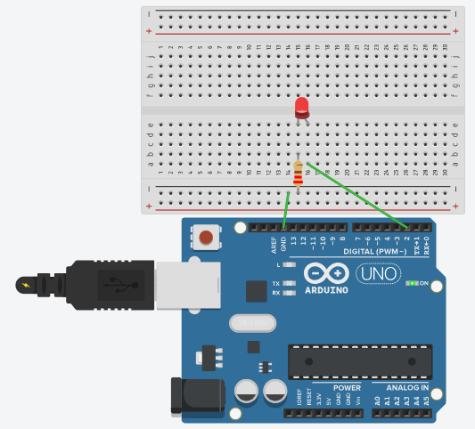

# Sistemas Embarcados com Arduino 

Este diretório contém as práticas desenvolvidas com a plataforma Arduino (via Tinkercad), focando na integração entre lógica de programação (firmware) e circuitos eletrônicos.

## Atividades Realizadas

### 1. Controle de Temporização (Blink LED)
O objetivo desta prática foi realizar o acionamento de uma saída digital para alternar o estado de um LED em intervalos de 1 segundo.

**Conceitos Aplicados:**
* **Saída Digital:** Configuração do Pino 2 como saída.
* **Resistor Limitador:** Uso de um resistor de 220Ω para proteção do componente.
* **Lógica de Loop:** Criação de um ciclo infinito de acendimento e apagamento.

**Esquema do Circuito:**

  
  
<b>Figura 1:</b> Simulação do circuito Blink utilizando o Pino Digital 2.

  <a href="https://www.tinkercad.com/things/kmfK5OYC6PL-exercise-01-blink-led-exercicio-01-blink-led">🔗 Clique aqui para acessar a simulação interativa no Tinkercad</a>

---

### 2. Sensor Crepuscular (Em Progresso)
*Descrição: Sistema automático que utiliza um LDR para controlar um LED conforme a luminosidade ambiente.*

## Componentes Utilizados
* 01 Arduino Uno R3
* 01 LED Vermelho
* 01 Resistor de 220Ω (para o LED)
* 01 Protoboard e Jumpers
