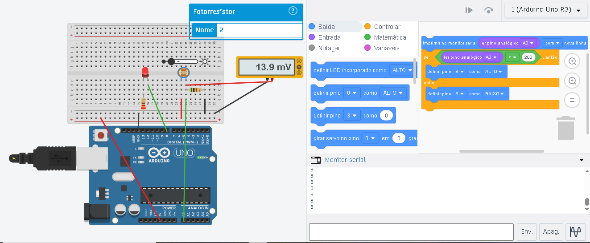

# Sistemas Embarcados com Arduino 

Este diretório contém as práticas desenvolvidas com a plataforma Arduino (via Tinkercad), focando na integração entre lógica de programação (firmware) e circuitos eletrônicos.

## Atividades Realizadas

### 1. Controle de Temporização (Blink LED)
O objetivo desta prática foi realizar o acionamento de uma saída digital para alternar o estado de um LED em intervalos de 1 segundo.

**Conceitos Aplicados:**
* **Saída Digital:** Configuração do Pino 2 como saída.
* **Resistor Limitador:** Uso de um resistor de 220Ω para proteção do componente.
* **Lógica de Loop:** Criação de um ciclo infinito de acendimento e apagamento.

**Esquema do Circuito:**

  
  
<b>Figura 1:</b> Simulação do circuito Blink utilizando o Pino Digital 2.

  <a href="https://www.tinkercad.com/things/kmfK5OYC6PL-exercise-01-blink-led-exercicio-01-blink-led">🔗 Clique aqui para acessar a simulação interativa no Tinkercad</a>

---

### 2. Sensor Crepuscular (LDR)
Implementação de um sistema automático que utiliza um fotorresistor para controlar o acionamento de um LED com base na luminosidade do ambiente.

**Conceitos Aplicados:**
* **Entrada Analógica:** Leitura de sinais variáveis (0 a 1023) através do pino A0.
* **Divisor de Tensão:** Uso de um fotorresistor (LDR) e um resistor fixo para converter variação de resistência em variação de tensão.
* **Lógica Condicional:** Implementação de uma estrutura "Se/Então/Senão" para definir o limiar de acionamento (Threshold < 200).
* **Monitoramento Serial:** Visualização em tempo real dos valores captados pelo sensor.

**Esquema do Circuito:**

  
  
<b>Figura 2:</b> Simulação do sensor crepuscular utilizando entrada analógica A0 e saída digital 8.

  <a href="https://www.tinkercad.com/things/2RSLdo5xVcm-exercise-02-ldr-light-sensor-exercicio-02-sensor-de-luz-ldr?sharecode=X_IJuaEhShNGa-jYucHFVUTQqwmG_XCkDBu9iIW97tg">🔗 Clique aqui para acessar a simulação interativa no Tinkercad</a>

> **Nota Técnica / Technical Note:**
> **PT:** Durante a simulação (Figura 2), observa-se que com baixa luminosidade, o divisor de tensão fornece **13.9mV** ao pino A0. O Arduino converte essa tensão para o valor **3** no Monitor Serial (conforme visível na imagem), acionando o LED já que o valor é menor que o limiar de 200.

> **EN:** During simulation (Figure 2), with low light, the voltage divider provides **13.9mV** to pin A0. The Arduino converts this to the value **3** in the Serial Monitor (as seen in the image), activating the LED since the value is below the 200 threshold.
